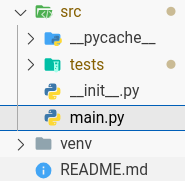

# Primer Examen de Python
### Pasos para el desarrollo del examen
### 1. instalacion de entorno virtual y modulos
1. primero hacemos `fork` del repositorio del proyecto
2. clonar el examen desde nuestro repositorio
   ```bash
   git clone url/ejemplo
   ```
3. accedemos al repositorio clonado
   ```bash
   cd nombreRepo
   ```
4. abrimos un area de trabajo a partir de la carpeta clonada en nuestro visual studio code.
5. una vez en el area de trabajo con la carpeta del examen abrimos nueva terminal y creamos un entorno virtual
   ```bash
   python -m venv venv
   ```
   ##### Observacio: esto creara un entorno virtula venv
6. activamos nuestro entorno virtual
    ##### bash: ejemplo
   ```bash
   source venv/Script/activate
   ```
   ##### Power Shell: ejemplo
   ```bash
   .\venv\Script\Activate.ps1
   ```
7. instalar pytest
   ```bash
   pip install pytest
   ```
### 2. pasos para la solucion de los ejercios
1. nos ubicamos en la siguiente direccion `src/main.py`
   
   
2. dentro del archivo encontraremos los ejericion con la siguiente estructura
   ##### ejemplo ejercicio
   ```python
   # primero ira el enuncia del ejercicio

   #1.la funcion devera devolver la resta de dos numeros pasos por parametro

   #luego esta la funcion creada
   def resta(a,b):
      pass # aqui tendremos que reemplazar pass por nuestra respuesta

   ```
   ##### ejemplo de solucion 1
   ```python
   #1.la funcion devera devolver la resta de dos numeros pasados por parametro
   def resta(a,b):
      resta=a-b
      return resta

   ```
   ##### ejemplo de solucion 2
   ```python
   #1.la funcion devera devolver la resta de dos numeros pasados por parametro
   def resta(a,b):
      return a-b

   ```
3. una vez realizada la solucion se debera comprobara que pase el test abrimos nuestra terminal y ejecutamos el siguiente comando
   ```python
   pytest -v
   ```
   esta nos mostrara informacion sobre los ejercicios correctos e incorrectos por consola los correctos se mostraran en verde y los incorrectos en rojo

4. finalmente haremos `push` a nuestro repositorio.
   